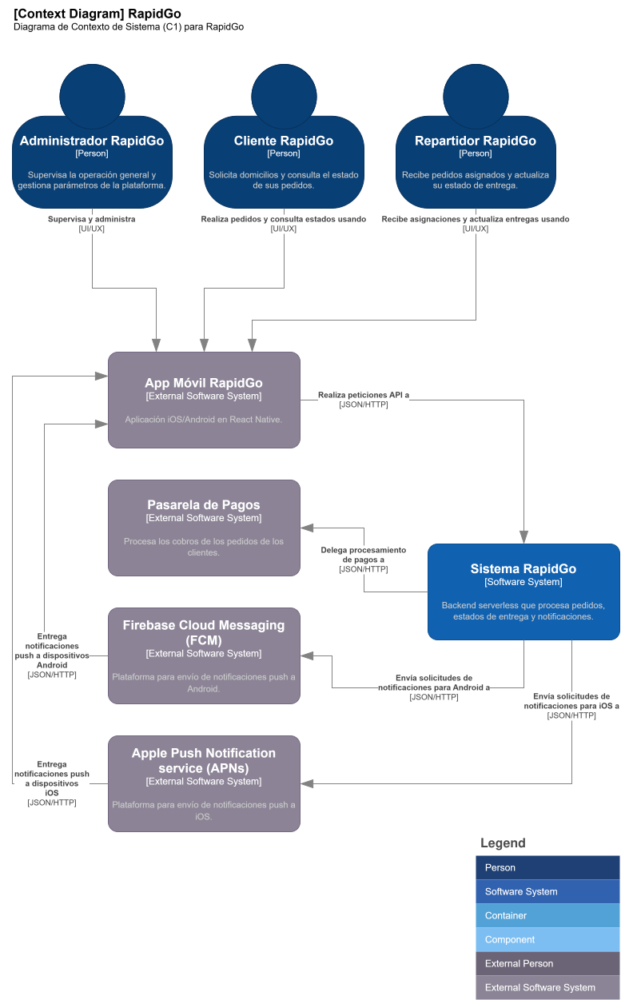
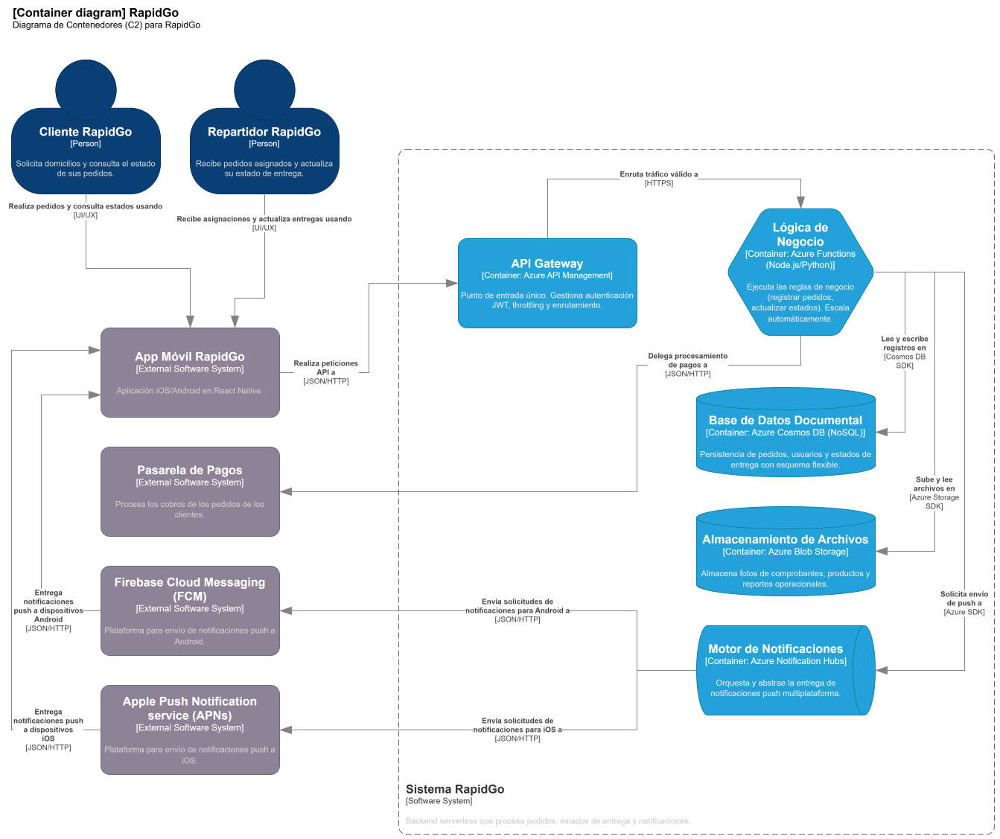
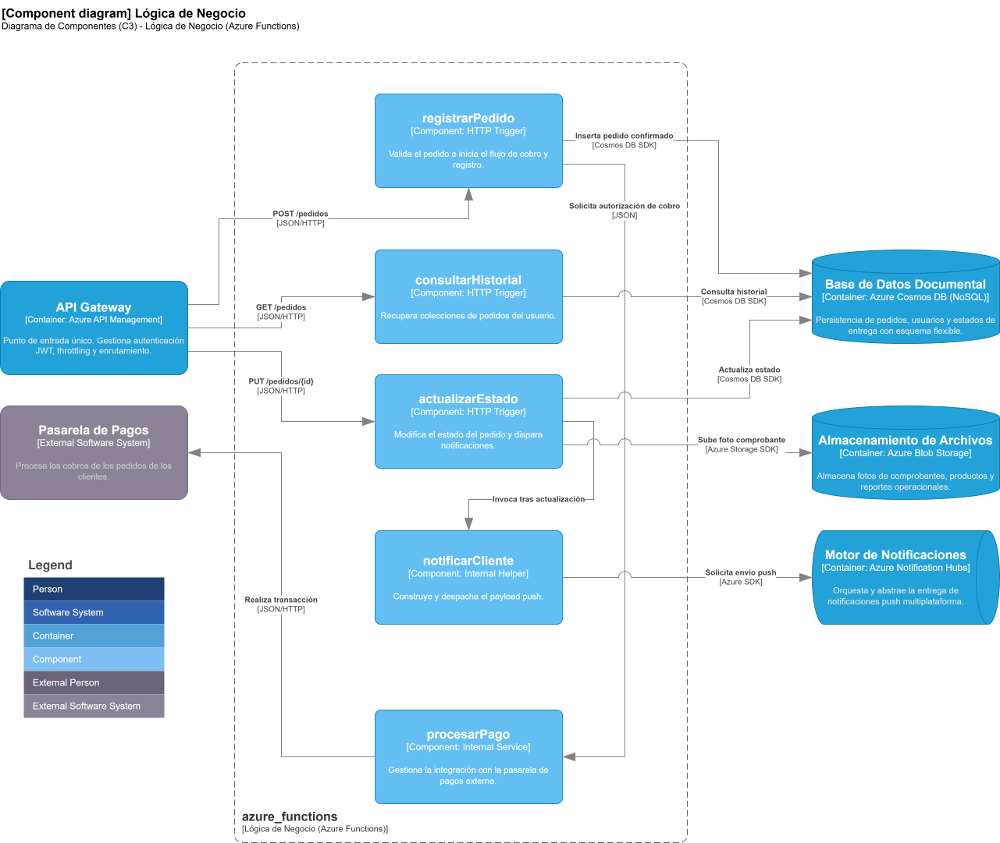

# Proyecto RapidGo - Backend Serverless en Azure

## Portada
* **Nombre del Proyecto:** RapidGo
* **Materia:** Cloud Computing
* **Estudiantes:** Diego Alejandro Barrios, Andrés Camilo Diaz, Jose Alejandro Colorado
* **Docente:** Julián David Flórez Sánchez
* **Institución:** Tecnológico de Antioquia (TdeA)

---

## 1. Modelo C4

### 1.1 Diagrama C1 - Contexto
Este diagrama representa la arquitectura de RapidGo en su nivel más alto de abstracción. El backend serverless se modela como un sistema central aislado (caja negra) para ilustrar explícitamente sus límites y las interacciones con las entidades externas al modelo de dominio.

**Elementos clave del diagrama:**
* **Sistema Central:** Sistema RapidGo (nueva arquitectura Cloud).
* **Actores Operativos:**
  * **Cliente:** Actor que inyecta la demanda transaccional (creación y monitoreo de pedidos).
  * **Repartidor:** Actor logístico que consume y actualiza los estados de entrega.
  * **Administrador:** Actor con privilegios de supervisión sobre la plataforma.
* **Dependencias de Software Externas:**
  * **App Móvil:** Cliente Frontend (React Native) que actúa como interfaz de usuario consumiendo la API de RapidGo.
  * **Pasarela de Pagos:** Servicio de terceros requerido para la autorización y captura de transacciones.
  * **FCM / APNs:** Proveedores de infraestructura externa (Google y Apple) utilizados para el enrutamiento y entrega de notificaciones push asíncronas hacia los dispositivos finales.

[Diagrama C1](assets/C4_Diagrams.drawio)

### 1.2 Diagrama C2 - Contenedores
Este diagrama expone la arquitectura interna del backend de RapidGo, reemplazando el monolito anterior por una arquitectura Serverless en Microsoft Azure orientada a alta disponibilidad, tolerancia a fallos y pago por uso.

**Componentes principales:**
* **Azure API Management:** Actúa como API Gateway y fachada para los clientes móviles, centralizando la seguridad (validación JWT) y protegiendo el sistema de sobrecargas mediante políticas de throttling.
* **Azure Functions:** Contenedor de procesamiento stateless que aloja la lógica de negocio escrita en Node.js o Python. Maneja elásticamente la concurrencia en los picos de demanda sin intervención manual.
* **Azure Cosmos DB:** Repositorio de datos NoSQL que sustituye al esquema relacional rígido anterior. Permite guardar la información de pedidos de forma documental, facilitando el registro de atributos variables.
* **Azure Blob Storage:** Destino de almacenamiento para objetos binarios pesados (imágenes y comprobantes).
* **Azure Notification Hubs:** Servicio de mensajería responsable del broadcasting e inserción unificada de notificaciones hacia Apple (APNs) y Google (FCM), resolviendo la baja tasa de entrega del sistema legado.  

[Diagrama C2](assets/C4_Diagrams.drawio)

### 1.3 Diagrama C3 - Componentes
Este diagrama detalla la arquitectura interna del contenedor de Azure Functions, exponiendo los componentes individuales responsables de ejecutar las reglas de negocio de RapidGo, procesar pagos y orquestar notificaciones.

**Componentes principales e interacciones:**
* **`registrarPedido` (HTTP Trigger):** Controlador que recibe el tráfico POST /pedidos validado desde API Management. Orquesta el flujo inicial: solicita la autorización de cobro al componente `procesarPago` e inserta el documento del pedido confirmado en Azure Cosmos DB mediante su SDK.
* **`consultarHistorial` (HTTP Trigger):** Endpoint de lectura expuesto para peticiones GET /pedidos. Se conecta a Azure Cosmos DB para recuperar y retornar las colecciones de pedidos asociadas al usuario.
* **`actualizarEstado` (HTTP Trigger):** Controlador logístico que procesa peticiones PUT /pedidos/{id}. Actualiza el estado del documento en Cosmos DB, carga las fotos de comprobantes de entrega hacia Azure Blob Storage y desencadena la ejecución del componente `notificarCliente`.
* **`procesarPago` (Internal Service):** Componente de integración interno que aísla la comunicación transaccional. Realiza peticiones JSON/HTTP hacia el sistema de software externo de la Pasarela de Pagos para efectuar los cobros.
* **`notificarCliente` (Internal Helper):** Servicio auxiliar invocado internamente tras la actualización de un estado. Construye el payload push y utiliza el Azure SDK para delegar el envío del mensaje al orquestador Azure Notification Hubs.

[Diagrama C3](assets/C4_Diagrams.drawio)

---

## 2. Decisiones Arquitectónicas (ADRs)

### ADR-01: Azure Functions vs App Service para la lógica de negocio

* **Contexto**: La plataforma sufre variaciones drásticas de tráfico (picos de 4.500 pedidos y valles con 4% de uso de CPU). El presupuesto piloto es menor a $50 USD. El equipo de infraestructura consta de una sola persona, por lo que se requiere minimizar la administración de servidores. Los lenguajes dominados son Node.js y Python.

* **Alternativas evaluadas**: 
    1. Azure Functions en Consumption Plan (Serverless). 
    2. Azure App Service (PaaS).

* **Decisión**: Se elige Azure Functions en Consumption Plan. 
* **Justificación técnica y de negocio**: Permite el escalado automático de 0 a N instancias sin intervención humana, soportando los picos de demanda. Al cobrar solo por tiempo de ejecución, elimina el costo fijo de $4.200.000 COP y encaja en el presupuesto piloto gracias al millón de ejecuciones gratuitas. Se implementará en Node.js o Python respetando el stack del equipo.

* **Consecuencias**: 
    * **Ventajas**: 
        * Reducción drástica de costos operativos y de infraestructura. 
        * Despliegues zero-downtime nativos.
    * **Trade-offs**: 
        * Riesgo de cold starts (arranques en frío) tras períodos de inactividad, lo cual es asumible dado que el objetivo de latencia P95 es < 800ms.

### ADR-02: Cosmos DB vs Azure SQL Database para la persistencia de pedidos

* **Contexto**: La base de datos actual es MySQL (relacional) con 3 años de histórico. Sin embargo, el negocio requiere un modelo flexible para manejar atributos variables por tipo de comercio. Se debe mantener el presupuesto controlado usando capas gratuitas. La región debe ser Brazil South o East US por latencia.

* **Alternativas evaluadas**:
    1. **Azure Cosmos DB (API for NoSQL).**
    2. **Azure SQL Database (Relacional).**

* **Decisión**: Se elige Azure Cosmos DB.
* **Justificación**: A pesar de la restricción de tener datos históricos en MySQL, se decide realizar un cambio de paradigma hacia NoSQL porque el modelo documental (JSON) resuelve el problema de los atributos variables sin esquemas rígidos. Adicionalmente, el Free Tier (1.000 RU/s y 25 GB) cubre los requerimientos del piloto sin costo.

* **Consecuencias**:
    * **Ventajas**: Alta disponibilidad inmediata, esquema dinámico ideal para los pedidos, sin costo inicial.
    * **Trade-offs**: Requiere un proceso de migración de datos (ETL) desde MySQL hacia Cosmos DB, asumiendo una deuda técnica temporal durante la transformación de los 3 años de datos históricos.

### ADR-03: API Management vs exposición directa de las Functions

* **Contexto**: La autenticación JWT actual es artesanal. Se requiere gestionar validación de tokens, limitar peticiones por usuario (throttling) y, fundamentalmente, mantener la compatibilidad exacta de los contratos de la API para no tener que rediseñar la App Móvil en React Native.

* **Alternativas evaluadas**:
    1. Azure API Management (Developer tier).
    2. Exposición directa de Azure Functions (usando function keys u oAuth).

* **Decisión**: Se elige Azure API Management.

* **Justificación**: Centraliza la validación JWT y el throttling, descargando esta responsabilidad del código de las Functions. Permite usar políticas de transformación de requests/responses para asegurar que los contratos de la API coincidan exactamente con lo que espera la app móvil actual, cumpliendo la restricción de no tocar el Frontend.

* **Consecuencias**:
    * **Ventajas**: Desacoplamiento de la seguridad, protección contra sobrecargas, compatibilidad garantizada con la app móvil.
    * **Trade-offs**: El nivel Developer no cuenta con SLA de producción. Deberá migrarse al nivel Basic o Standard post-piloto, incrementando los costos.

### ADR-04: Blob Storage vs Azure Files para almacenamiento de archivos

* **Contexto**: Es necesario guardar fotos de comprobantes de entrega, imágenes de productos y exports de reportes. Se busca la opción de menor costo para objetos no estructurados.

* **Alternativas evaluadas**:

    1. Azure Blob Storage (LRS Standard).
    2. Azure Files.

* **Decisión**: Se elige Azure Blob Storage (LRS Standard).

* **Justificación**: Blob Storage está optimizado específicamente para el almacenamiento masivo de datos no estructurados (imágenes, reportes) al menor costo posible. No se requiere la semántica de un sistema de archivos tradicional (SMB/NFS) que ofrece Azure Files.

* **Consecuencias**:
    * **Ventajas**: Costo mínimo por GB de almacenamiento, integración nativa y directa mediante el SDK en Azure Functions.
    * **Trade-offs**: Los archivos no pueden ser montados directamente como un disco en un sistema operativo, lo cual no es necesario para esta arquitectura stateless.

### ADR-05: Notification Hubs vs Azure Communication Services para notificaciones push

* **Contexto**: El sistema actual tiene una tasa de entrega del 67%. Se requiere notificar en tiempo real a dispositivos Android (FCM) e iOS (APNs) sobre el cambio de estado de los pedidos, con un objetivo de entrega > 95% y maximizando el uso de capas gratuitas.

* **Alternativas evaluadas**:
    1. Azure Notification Hubs.
    2. Gestión manual desde Azure Functions conectándose a las APIs de FCM y APNs.

* **Decisión**: Se elige Azure Notification Hubs.

* **Justificación**: Actúa como un motor de orquestación unificado que abstrae la complejidad de comunicarse con APNs y FCM por separado, resolviendo los problemas de entrega del sistema legado. El Free tier cubre 1 millón de notificaciones mensuales, ajustándose al presupuesto.

* **Consecuencias**:
    * **Ventajas**: Cumplimiento de la métrica de entrega > 95%, envío unificado multiplataforma, descarga de procesamiento a las Functions.
    * **Trade-offs**: Requiere refactorizar la lógica en la App Móvil (React Native) para registrar los identificadores de dispositivos (tokens) contra Notification Hubs en lugar del backend legado.

---

## 3. Implementación del Flujo Crítico (Evidencias)

A continuación, se documentarán las evidencias visuales (capturas de pantalla) del funcionamiento de extremo a extremo:

1. **Grupo de recursos en Azure:**
   
   
2. **Logs de ejecución exitosa:**
   *(TODO)*
3. **Documento en Cosmos DB:**
   *(TODO)*
4. **Notificación enviada (Notification Hubs):**
   *(TODO)*
5. **Pruebas de la API:**
   *(TODO)*

---

## 4. Conclusiones

Durante el diseño y ejecución del piloto serverless de RapidGo, se identificaron y superaron importantes retos técnicos que definen las mejores prácticas para futuros despliegues:

1. **Restricciones de Suscripción para la IaC:** 
   Debido a las limitaciones inherentes de una suscripción de estudiante (Azure for Students), la implementación de Infraestructura como Código mediante Terraform no pudo realizarse con un `Service Principal` tradicional. Esto forzó a utilizar la sesión local autenticada directamente o una `Managed Identity` (identidad administrada) para la ejecución segura del despliegue, demostrando adaptabilidad en entornos con permisos restringidos.

2. **Manejo de Capacidad y Latencia en Capa Gratuita (Free Tier):** 
   Se experimentaron errores de `ServiceUnavailable` al intentar provisionar **Azure Cosmos DB** (Free Tier) con redundancia de zona (Availability Zones) en la región **East US**. La limitación de capacidad física para recursos gratuitos obligó a desactivar la redundancia de zona (`zone_redundant = false`) y a explorar regiones alternas como `East US 2` o `Brazil South`. Esto resalta la importancia de equilibrar el ahorro de costos frente a la posible penalidad de latencia al ubicar servicios interdependientes (Functions y DB) en diferentes datacenters.

3. **Gestión de Secretos sin Alterar la Arquitectura (Key Vault):**
   A pesar de la necesidad de inyectar credenciales sensibles (como los certificados y llaves para FCM/APNs en Notification Hubs), se decidió **no implementar Azure Key Vault**. La inclusión de Key Vault habría agregado complejidad operativa al piloto y modificado la estructura C2/C3 ya definida y aprobada. Como mitigación segura, se utilizaron variables marcadas como sensibles (`sensitive = true`) nativas en Terraform, logrando que los secretos se pasen e inyecten de forma segura a las variables de entorno de Azure Functions durante el despliegue sin quemarlas en el código fuente.

4. **Sincronización de Infraestructura Híbrida (Drift Resolution):** 
   Ante fallos críticos de aprovisionamiento automatizado debido a cuotas de región, se implementó una estrategia exitosa de creación manual controlada seguida de una sincronización forzada hacia el estado de Terraform (`terraform import`). Este proceso permitió recuperar la gestión del ciclo de vida de recursos críticos (CosmosDB en `West US 2` y Function App en plan `Flex Consumption`) sin destruir la infraestructura existente ni comprometer los secretos almacenados en GitHub Actions. Esta experiencia demuestra que la infraestructura como código (IaC) puede coexistir y recuperarse de intervenciones manuales necesarias en entornos de nube con restricciones dinámicas de capacidad.

5. **Estrategia de Pruebas en Entornos Serverless:**
   Para garantizar la calidad del software sin incurrir en costos de ejecución innecesarios durante el desarrollo, se implementó una estrategia de pruebas en dos niveles. Primero, **pruebas unitarias** utilizando `unittest.mock` para simular las interacciones con Azure Cosmos DB, permitiendo validar la lógica de negocio de forma aislada y rápida en el entorno local. Segundo, se enriqueció la **Colección de Postman** con scripts de prueba automatizados que verifican los contratos de la API y los códigos de respuesta (`200 OK`, `201 Created`). Esta combinación asegura que el backend sea robusto y cumpla con las expectativas antes de su despliegue final en el entorno de producción de Azure.